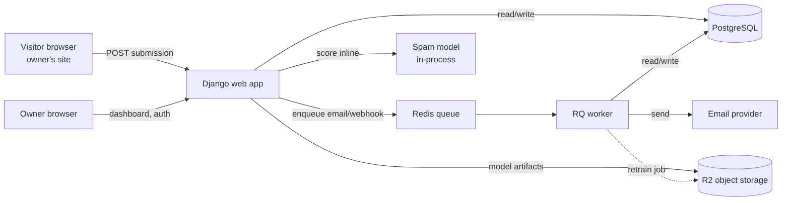
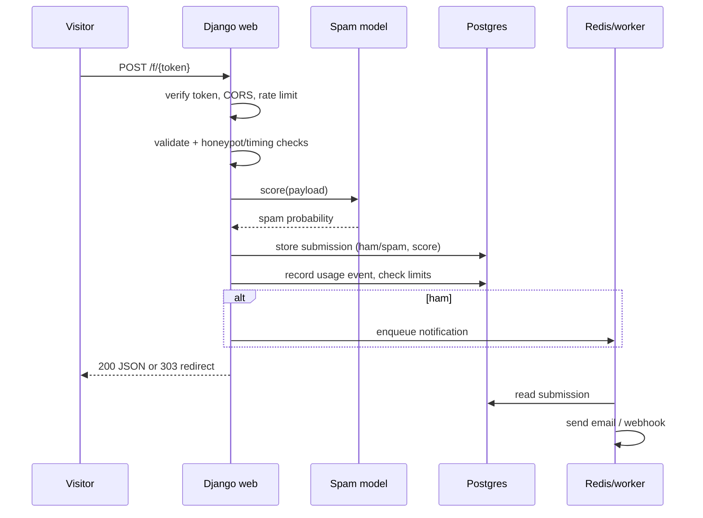
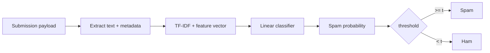

# Project 1 SRS — Form Backend with Spam Filtering

Sep 24, 2026 · @Oryn Bonya

A software requirements specification for Project 1 of the 100-day plan: a drop-in form-submission backend with an ML spam filter, which also establishes the shared foundation (auth, storage, worker, plan/limits, metering) the later projects reuse as a pattern. Stack: Django. Timeline: days 1–14.

## 1. Overview

This project delivers a hosted endpoint that any website — especially a static or JAMstack site with no backend — can POST its HTML forms to, so submissions are validated, spam-filtered, stored, and forwarded to the owner. It is Project 1 of the 100-day plan and doubles as the build of the **shared foundation**: account/auth, Postgres, object storage, a background worker, the plan/limits layer, and usage metering. Getting these right here pays off in the five projects that reuse the patterns.

**In scope (v1)**

- Owner sign-up, login, and account management.
- Create a form and receive a unique submission endpoint URL.
- Accept cross-origin POSTs (JSON and form-encoded), validate, and store each submission.
- Score every submission with an ML spam classifier; mark as ham/spam.
- Email the owner on new (ham) submissions.
- A dashboard listing forms and submissions, with spam/ham correction.
- Rate limiting and basic abuse protection.
- Plan/limits and metering wired in but set to a generous free tier.

**Out of scope (v1)**

- File-upload fields in forms (foundation supports object storage, but form attachments are deferred).
- Slack/webhook/sheet integrations (payment-seam feature, later).
- Team accounts, multi-user per account.
- Native spam-model retraining UI (retraining is a scripted/ops task in v1).

**Goals**

- A submitter's POST completes in well under a second, spam-scored inline.
- The owner never configures a server; they paste one endpoint URL into their form's `action`.
- The foundation is clean enough to serve as the reference architecture for later projects.

**Non-goals**

- Competing on features with Formspree at launch; this is a learning-and-real-users build.
- A perfect spam model; a good, improvable classifier with a feedback loop is enough.

## 2. Users and stakeholders

Three roles interact with the system; only one has an account.

- **Site owner / developer (primary user, has an account).** Owns a website, creates forms, wires the endpoint into their HTML, and reads submissions. Technically comfortable enough to edit HTML. Wants zero server setup and reliable delivery to their inbox.
- **Form end-user (submitter, anonymous).** A visitor to the owner's site filling in a contact form. Never sees this platform and never logs in; their only interaction is the POST. Must not be slowed down or blocked by legitimate use.
- **Operator (you).** Runs the service, retrains and deploys the spam model, watches metering and cost, handles abuse. Uses the Django admin plus scripts.

The design tension between the first two roles matters: the owner wants aggressive spam blocking; the submitter must never be wrongly blocked. The classifier therefore *flags* rather than silently drops by default, and every decision is reversible from the dashboard.

## 3. Tech stack and rationale

Django, chosen because the foundation needs auth, ORM, migrations, sessions, and an admin panel on day one — all batteries-included — so you build a complete foundation fast and get a working reference architecture. The frontend stays server-rendered and lean to match the lightweight goal.

| Layer | Choice | Rationale |
| --- | --- | --- |
| Language | Python 3.12+ | Serves both the web app and the spam model in one language |
| Web framework | Django 5.x | Auth, ORM, migrations, admin out of the box; ideal foundation |
| API style | Django views + forms; DRF only if needed | The ingest endpoint is simple; avoid DRF weight unless the dashboard API grows |
| Database | PostgreSQL 16 | The one relational store for all six projects; JSONB for flexible submission payloads |
| Object storage | Cloudflare R2 (or Backblaze B2) | Foundation piece; no egress fees; used for model artifacts now, attachments later |
| Queue + worker | Redis + RQ (or Celery) | Async email and webhooks; RQ is lighter for a solo start |
| Frontend | Django templates + Tailwind CSS + HTMX | Lean dashboard interactivity without a SPA |
| ML | scikit-learn (TF-IDF + linear model) | Small, CPU-only, trains and serves in-process; no cloud inference bill |
| Email | Postmark or SendGrid | Transactional delivery with good deliverability and DKIM/SPF support |
| Payments | Stripe (SDK stubbed, off) | Payment seam wired but inactive |
| Packaging | Docker + Docker Compose | One command locally; portable to both deploy targets |
| Config | django-environ / env vars | 12-factor; secrets never in code |

**Deployment target is deliberately left open** — the container setup runs unchanged on a single VPS (Docker Compose) and on a PaaS (Railway/Render/Fly), and you will test both. See section 12.

## 4. System architecture

A single Django application backed by Postgres and Redis, with one worker process for slow tasks. The spam model loads into the web process at startup and scores inline (it is fast, low-tens-of-milliseconds), so the submitter gets an immediate response; only email and webhooks are deferred to the worker.

**Components**

- **Web app** — handles the public ingest endpoint, owner auth, dashboard, rate limiting, and inline spam scoring.
- **PostgreSQL** — accounts, forms, submissions (payload in JSONB), model-version records, plan/limits, usage events.
- **Redis + RQ worker** — email notifications, webhook delivery, and scheduled retrain jobs; keeps the request path fast.
- **Spam model** — a serialized scikit-learn pipeline loaded at boot; versioned artifact stored in R2.
- **R2 object storage** — model artifacts now; a foundation piece reused for attachments and later projects.

**Submission request lifecycle**

The worker being down degrades gracefully: submissions are still stored and scored; only notifications queue up until it recovers.

## 5. Data model

Entities below map to Django models. `Account` is separated from `User` from the start so team accounts (a later project pattern) do not require a migration rewrite. Submission field values live in a JSONB column so forms need no fixed schema.

**Account** — billing/limits owner.

| Field | Type | Notes |
| --- | --- | --- |
| id | uuid (pk) |  |
| name | text |  |
| plan | text | `free` by default; drives limits |
| created\_at | timestamptz |  |

**User** — login identity, belongs to an Account.

| Field | Type | Notes |
| --- | --- | --- |
| id | uuid (pk) |  |
| account\_id | fk Account |  |
| email | citext unique |  |
| password | text | Django-hashed |
| is\_verified | bool | email verification |

**Form** — one per owner form; carries the public token.

| Field | Type | Notes |
| --- | --- | --- |
| id | uuid (pk) |  |
| account\_id | fk Account |  |
| name | text |  |
| token | text unique | the public `/f/{token}` id |
| allowed\_origins | text\[\] | CORS allow-list |
| redirect\_url | text null | for form-encoded POSTs |
| spam\_action | text | `flag` or `drop`; default `flag` |
| is\_active | bool |  |

**Submission** — one received POST.

| Field | Type | Notes |
| --- | --- | --- |
| id | uuid (pk) |  |
| form\_id | fk Form |  |
| payload | jsonb | submitted fields |
| spam\_score | float | model probability |
| status | text | `ham` / `spam` |
| corrected | bool | owner overrode the label |
| source\_ip\_hash | text | hashed, for rate limiting/abuse |
| model\_version\_id | fk ModelVersion | which model scored it |
| created\_at | timestamptz |  |

**ModelVersion** — a trained spam model.

| Field | Type | Notes |
| --- | --- | --- |
| id | uuid (pk) |  |
| version | text | semver or date tag |
| artifact\_key | text | R2 object key |
| metrics | jsonb | precision/recall at threshold |
| is\_active | bool | the one currently served |
| created\_at | timestamptz |  |

**UsageEvent** — the metering log (foundation).

| Field | Type | Notes |
| --- | --- | --- |
| id | bigint (pk) |  |
| account\_id | fk Account |  |
| kind | text | e.g. `submission` |
| quantity | int | usually 1 |
| created\_at | timestamptz | indexed for monthly rollups |

Plan limits are config, not a table in v1: a `PLANS` dict maps `plan` → `{max_forms, max_submissions_per_month, features}`, read by a single `check_limit()` helper.

## 6. Functional requirements

**Auth and accounts**

- FR-1.1 Register with email and password; create an Account and a User.
- FR-1.2 Send an email verification link; block sending notifications until verified.
- FR-1.3 Log in, log out, and reset password via email.
- FR-1.4 A settings page to view plan and current-month usage.

**Form management**

- FR-2.1 Create a form with a name; system generates a unique public token and endpoint URL.
- FR-2.2 Configure per-form: allowed origins, redirect URL, spam action (`flag`/`drop`), active/inactive.
- FR-2.3 List, edit, and deactivate forms.
- FR-2.4 Show copy-paste HTML snippet with the endpoint URL.

**Submission ingestion**

- FR-3.1 Accept POST at `/f/{token}` in JSON and form-encoded bodies.
- FR-3.2 Validate content type, body size, and required anti-abuse fields.
- FR-3.3 Enforce the form's CORS allow-list; reject disallowed origins.
- FR-3.4 Store every accepted submission with payload, score, and status.
- FR-3.5 Return 200 JSON for API callers, or 303 redirect to `redirect_url` for classic form posts.
- FR-3.6 Reject inactive forms and over-limit accounts with clear status codes.

**Spam filtering**

- FR-4.1 Score every submission inline with the active model.
- FR-4.2 Apply honeypot-field and submit-timing heuristics as hard signals.
- FR-4.3 Label `spam`/`ham` by threshold; apply the form's spam action.
- FR-4.4 Let the owner flip a submission's label from the dashboard (sets `corrected`).

**Notifications**

- FR-5.1 On a new ham submission, enqueue an email to the owner.
- FR-5.2 Email includes submitted fields and a dashboard link; never blocks the response.
- FR-5.3 Optionally digest instead of per-submission (config, later).

**Dashboard**

- FR-6.1 List submissions per form, newest first, filterable by ham/spam.
- FR-6.2 View a single submission's full payload.
- FR-6.3 Export submissions as CSV.
- FR-6.4 Show per-form counts and current-month usage against the limit.

**Rate limiting and limits**

- FR-7.1 Rate-limit by source-IP hash and by form token.
- FR-7.2 Check plan limits before storing; reject with 429/402-style response when exceeded.
- FR-7.3 Record a UsageEvent per stored submission.

## 7. The ML component

The spam classifier is deliberately small: a scikit-learn pipeline of TF-IDF over the submission text plus a few engineered metadata features, feeding a linear classifier (logistic regression or linear SVM). It is CPU-only, serializes to a small artifact, loads in-process, and scores in low-tens of milliseconds — no cloud inference bill. This is the first-ML-in-production project precisely because the model is cheap and a wrong call is low-cost and reversible.

**Features**

- TF-IDF of concatenated text fields (word and char n-grams).
- Metadata signals: link count, presence of URLs in name fields, all-caps ratio, message length, honeypot-field filled (hard signal), submit-timing too fast (hard signal), origin mismatch.

**Pipeline**

**Training**

- Bootstrap on a public spam/ham corpus (e.g. SMS/email spam datasets) to ship a usable v1 model before you have real data.
- Then retrain on your own labelled submissions as they accumulate, especially owner corrections.
- Training is an offline script that writes a new `ModelVersion` (artifact to R2, metrics to the row), toggled active manually in v1.

**Serving and versioning**

- The active `ModelVersion` artifact is loaded at web-process startup and cached in memory.
- Every submission stores the `model_version_id` that scored it, so metrics are attributable per version.
- Rolling out a model = train, review metrics, set `is_active`, restart/reload.

**Feedback loop**

- Owner spam/ham corrections (FR-4.4) are the labelled data flywheel; `corrected=true` rows are high-value training examples.
- A scheduled worker job can periodically assemble a fresh training set from corrected + confidently-labelled rows.

**Monitoring**

- Track score distribution, spam rate per form, and owner-correction rate (a proxy for false positives).
- Alert if correction rate crosses a threshold — the signal that the model needs retraining.

**Threshold policy.** Default to `flag` (store as spam, keep it visible) rather than `drop`, tuned for high precision on the spam class so legitimate submissions are rarely hidden; `drop` is opt-in per form.

## 8. API and external interfaces

**Public submission endpoint** — the one interface the owner's visitors hit.

- `POST /f/{token}`
- Accepts `application/json` or `application/x-www-form-urlencoded` (and `multipart/form-data` for future attachments).
- Body: arbitrary form fields; reserved fields `_honeypot` (must be empty), `_ts` (render timestamp for timing check), optional `_redirect`.
- Success (JSON caller): `200 {"ok": true, "id": "<submission id>"}`.
- Success (form caller): `303` redirect to the form's `redirect_url`.
- Errors: `403` origin not allowed, `404` unknown/inactive token, `413` body too large, `422` validation failed, `429` rate-limited or over limit.
- CORS: `Access-Control-Allow-Origin` echoes an allowed origin; preflight `OPTIONS` supported.

**Owner-facing web (session-authenticated, server-rendered)**

- `/signup`, `/login`, `/logout`, `/verify/{token}`, `/reset` — auth flows.
- `/dashboard` — forms overview and usage.
- `/forms/new`, `/forms/{id}` — create and configure forms; shows the snippet.
- `/forms/{id}/submissions` — list, filter, view, correct labels, export CSV.
- `/settings` — plan and usage.
- `/admin` — Django admin for the operator.

**Email (outbound)** — transactional via the provider: verification, password reset, and new-submission notifications, all sent from the worker.

**Webhooks (payment-seam, later)** — an optional per-form outbound POST on new submission; defined now, built when monetized.

**Model artifact storage** — R2 via S3-compatible API; the app reads the active artifact by key at startup, the training script writes new ones.

## 9. Non-functional requirements

- **NFR-1 Latency.** The submission endpoint responds in under 300 ms p95 with inline spam scoring; email is off the request path.
- **NFR-2 Throughput.** A single small instance handles the modest submission volume of many small sites; the worker absorbs bursts of notifications.
- **NFR-3 Availability.** 99.5% target at launch; graceful degradation — submissions store and score even if the worker or email provider is down.
- **NFR-4 Security.** Passwords hashed by Django; secrets in env; OAuth/API keys and R2 credentials never in code; least-privilege R2 token.
- **NFR-5 Email deliverability.** SPF, DKIM, and DMARC configured for the sending domain; bounces and complaints handled so the service is not itself flagged as spam.
- **NFR-6 Privacy and retention.** Submissions contain third-party personal data; store only what is submitted, hash source IPs, offer per-form retention/auto-delete, and provide export and deletion. Publish a basic privacy policy.
- **NFR-7 Accessibility.** Dashboard meets WCAG 2.1 AA basics.
- **NFR-8 Browser support.** The endpoint is server-side and browser-agnostic; the dashboard targets the latest two versions of major browsers.
- **NFR-9 Scalability path.** Stateless web process behind a load balancer; Postgres and Redis as the only stateful services; scale web and worker independently.
- **NFR-10 Observability.** Structured logs, error tracking (e.g. Sentry), and the metering table double as basic product analytics.

## 10. Payment seams and metering

Monetization is wired but off. Three seams (from the master plan) appear here first and become the template for the other projects.

- **Plan/limits layer.** A `PLANS` config maps each plan to its limits and feature flags; a single `check_limit(account, kind)` helper is called before storing a submission and before creating a form. Free tier sets generous limits; a paid tier just changes the numbers.
- **Feature flags.** Per-plan flags gate later extras (webhooks, integrations, longer retention, digest emails, remove branding). Checked in one place, all off/limited on free.
- **Metering.** A `UsageEvent` row per stored submission; a cheap monthly rollup per account powers both limit checks and future pricing. This log is also your first real usage dataset.

**Indicative free tier (adjust from real usage):** up to 3 forms, up to \~250 submissions/month, per-submission email, 30-day retention. Paid tiers raise submissions/forms/retention and unlock integrations.

**Turning on payment later** = add the Stripe SDK (import stubbed now), create products/prices, tighten free limits, flip flags. No structural change — that is the point of doing the seams now.

## 11. Security and abuse prevention

The public endpoint is an open door on the internet, so abuse handling is a core feature, not a hardening afterthought.

- **Spam** — the ML classifier plus hard heuristics (honeypot field, submit-timing) is the first line; see section 7.
- **Rate limiting** — per source-IP hash and per form token, with sane per-minute and per-hour caps; return 429 on breach.
- **CORS allow-list** — each form declares its origins; the endpoint rejects others. The public endpoint is intentionally CSRF-exempt (it is cross-origin by design) and instead defended by origin checks, rate limits, and spam scoring.
- **Input limits** — max body size, max field count and length; reject oversized payloads with 413 before doing work.
- **Secrets** — all credentials in env vars; R2 token scoped to the one bucket; provider API keys rotated; nothing in the repo.
- **Submitter data / GDPR** — submissions hold third-party personal data. Hash source IPs, support per-form retention and auto-delete, allow the owner to delete a submission, and publish a privacy policy. Be explicit that the owner is the data controller and you are the processor.
- **Account security** — Django's password hashing and session framework; email verification before notifications; rate-limit auth endpoints against credential stuffing.
- **Operational** — error tracking excludes submission payload contents from logs to avoid leaking personal data.

## 12. Deployment and operations

Everything is containerized so the same artifact runs on both targets you want to try. The stack is Docker Compose with four services: `web` (Django + gunicorn), `worker` (RQ), `db` (Postgres), `redis`.

- **Config** — 12-factor via env vars: `DATABASE_URL`, `REDIS_URL`, R2 keys, email provider key, `SECRET_KEY`, `ALLOWED_HOSTS`, Stripe keys (unused). One `.env` locally; provider secrets in prod.
- **Migrations** — Django migrations run on deploy; never edit the DB by hand.
- **Static/Tailwind** — build Tailwind at image build; serve static via WhiteNoise (simple) or the platform's static handling.
- **Two deploy targets to compare** — (a) a single small VPS running Docker Compose behind Caddy/Nginx for TLS — cheapest, full control, you manage updates; (b) a PaaS (Railway/Render/Fly) — push-to-deploy, managed Postgres/Redis, less ops, slightly more cost. Try both; note the trade-offs for later projects (monitoring in Project 2 will prefer the persistent VPS; analytics in Project 3 will test the PaaS).
- **Backups** — automated daily Postgres dump to R2; test a restore once.
- **Logging/monitoring** — structured logs to stdout, error tracking (Sentry free tier), and a health-check endpoint (which Project 2 will later watch).
- **Model deploys** — the active model artifact lives in R2; a new version is a train-script run plus an `is_active` flip and a web reload.

**Environments** — local (Compose), and one production. A staging step is optional at this scale; keep it if the PaaS makes it free.

## 13. Build order (days 1–14)

Front-loaded on the foundation, since it is reused conceptually across all six projects. The ML piece comes once submissions can flow.

| Day | Focus | Outcome |
| --- | --- | --- |
| 1 | Project + Docker Compose skeleton (web, db, redis, worker) | `docker compose up` runs an empty Django app |
| 2 | Data model + migrations (Account, User, Form, Submission, ModelVersion, UsageEvent) | Schema in place; admin registered |
| 3 | Auth: signup, login, logout, email verification, reset | Owner can create and verify an account |
| 4 | Form CRUD + token generation + snippet display | Owner can create a form and see its endpoint |
| 5 | Ingest endpoint: accept POST, validate, store, CORS | A raw submission is received and saved |
| 6 | Redirect vs JSON responses; body/size limits; error codes | Endpoint behaves for both API and classic form callers |
| 7 | Rate limiting + plan/limits (`check_limit`) + UsageEvent | Abuse-capped, metered ingestion |
| 8 | Bootstrap spam model: train on public corpus, save artifact to R2 | A v1 model artifact exists |
| 9 | Inline scoring + honeypot/timing heuristics + labelling | Submissions are scored ham/spam on arrival |
| 10 | Worker: enqueue + send notification emails | Owner gets emailed on new ham submissions |
| 11 | Dashboard: submissions list, filter, detail, CSV export | Owner can read and export submissions |
| 12 | Label correction + `corrected` flag + model monitoring counters | Feedback loop and correction-rate signal live |
| 13 | Deployment: ship to VPS and to a PaaS; TLS; backups | Live on both targets; trade-offs noted |
| 14 | Polish, deliverability (SPF/DKIM/DMARC), docs, buffer | Production-ready v1 |

If a day slips, the safe cut is CSV export (day 11) or the digest option; do not cut rate limiting or deliverability.

## 14. Risks and open questions

**Risks**

- **Email deliverability** — the sneaky-hard part; a service that emails from a fresh domain can land in spam. Mitigate with a reputable provider, SPF/DKIM/DMARC, and warm-up. Budget day 14 for it.
- **Spam model cold start** — the bootstrap model may misfire on real traffic. Default to `flag` not `drop`, ship the correction loop early, retrain once real labels exist.
- **Abuse of the open endpoint** — someone could hammer a token. Rate limiting and body limits from day 7, before launch.
- **Scope creep in the foundation** — it is tempting to over-build the shared base. Build only what this project needs; generalize later projects when they actually need it.
- **14 days is tight** given the foundation is included. The build order names safe cuts.

**Open questions**

- Email provider: Postmark (better deliverability, paid) vs SendGrid free tier vs Resend — decide by day 10.
- Queue: RQ (simpler) vs Celery (more capable) — RQ recommended for a solo start; confirm.
- Spam action default: is `flag` the right global default, with `drop` opt-in? (Assumed yes.)
- Retention default: 30 days on free — confirm against how you want to position privacy.
- Do you want a minimal public marketing page in v1, or dashboard-only at first?

Resolve the email-provider and queue questions before day 8; the rest can be defaults you revisit.
